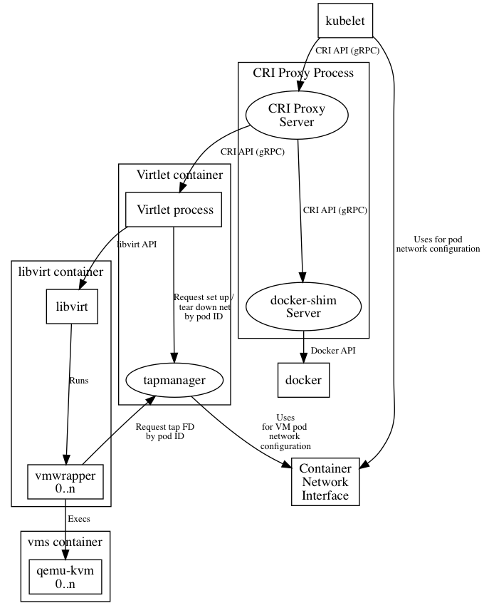

# Overview

The following figure provides a general view of Virtlet architecture:

Virtlet consists of the following components:

* [Virtlet manager](../cmd/virtlet) - implements CRI interface for virtualization and image handling
* [libvirt](http://libvirt.org) instance
* [vmwrapper](../cmd/vmwrapper) which is responsible for preparing environment for emulator
* emulator, currently [qemu](http://www.qemu-project.org/) with KVM support (with possibility to disable KVM)

In addition to the above, our example setup provides the following:

* [Image service](../deploy/image-service.yaml) which provides VM images accessible through HTTP in local cluster environment. It's only used as an optional helper, because Virtlet manager can pull images from any HTTP server accessible from the node.
* [CRI proxy](../cmd/criproxy) which provides the possibility to mix docker-shim and VM based workloads on the same k8s node.

## Virtlet manager

The main binary is responsible for providing API fullfiling
[CRI specification](https://github.com/kubernetes/community/blob/master/contributors/design-proposals/container-runtime-interface-v1.md).
It serves the requests from kubelet by doing the following:

* controlling the preparation of libvirt VM environment (virtual
  drives, network interfaces, trimming resources like RAM, CPU),
* calling [CNI plugins](https://kubernetes.io/docs/admin/network-plugins/#cni) to setup network environment for virtual machines,
* telling libvirt to call vmwrapper instead of using emulator directly
* querying libvirt for VM statuses,
* instructing libvirt to stop VMs,
* and finally calling libvirt to tear down VM environment.

## vmwrapper

vmrapper is responsibile for:
* passing the network configuration prepared by CNI plugins to the VM by means of built-in DHCP server
* spawning emulator (currently qemu-kvm),
* responding to DHCP queries from VM,
* signaling emulator to stop VM,
* reconstructing network interfaces to initial state for CNI teardown procedure.

## CRI Proxy

CRI Proxy provides a way to run multiple CRI implementations on the
same node, e.g. Virtlet and docker-shim. This is handy for running
infrastructure pods such as kube-proxy. CRI Proxy reuses docker-shim
component from kubelet to make it possible to have Docker as one of
CRI implementations on the multi-runtime nodes.
See [CRI Proxy design document](criproxy.md) for more detailed
description.
