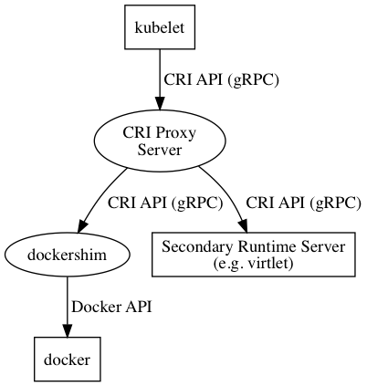

# CRI Proxy

CRI Proxy makes it possible to run several CRI implementations on the
same node. It also includes in-process docker-shim which is currently
imported from k8s 1.5 code. CRI Proxy isn't tied to Virtlet in the
sense that it can be used with other runtimes, too. Docker-shim usage
is also optional.

## How CRI Proxy works

Below is a diagram depicting the way CRI Proxy works. The basic idea
is forwarding the requests to different runtimes based on prefixes of
image name / pod id / container id prefixes.



Let's say CRI proxy is started as follows:
```
/usr/local/bin/criproxy -v 3 -alsologtostderr -connect docker,virtlet:/run/virtlet.sock
```

`-v 3 -alsologtostderr` options here may be quite useful for
debugging, because they make CRI proxy log detailed info about every
CRI request going through it, including any errors and the result.

`-connect docker,virtlet:/run/virtlet.sock` specifies the list of
runtimes that the proxy passes requests to.

The `docker` part is a special case, meaning that `criproxy` must
start in-process `docker-shim` and use it as the primary (prefixless)
runtime.  It's also possible to specify other primary runtime instead,
e.g. `/run/some-other-runtime.sock`.

`virtlet:/run/virtlet.sock` denotes an alternative runtime
socket. This means that image service requests that include image
names starting with `virtlet/` must be directed to the CRI
implementation listening on a Unix domain socket at
`/run/virtlet.sock`. Pods that need to run on `virtlet` runtime must
have `virtlet` as the value of `kubernetes.io/target-runtime`
annotation.

There can be any number of runtimes, although probably using more than
a couple of runtimes is a rare use case.

Here's an example of a pod that needs to run on `virtlet` runtime:
```
apiVersion: v1
kind: Pod
metadata:
  name: cirros-vm
  annotations:
    kubernetes.io/target-runtime: virtlet
    scheduler.alpha.kubernetes.io/affinity: >
      {
        "nodeAffinity": {
          "requiredDuringSchedulingIgnoredDuringExecution": {
            "nodeSelectorTerms": [
              {
                "matchExpressions": [
                  {
                    "key": "extraRuntime",
                    "operator": "In",
                    "values": ["virtlet"]
                  }
                ]
              }
            ]
          }
        }
      }
spec:
  containers:
    - name: cirros-vm
      image: virtlet/image-service/cirros
```

First of all, there's `kubernetes.io/target-runtime: virtlet`
annotation that directs `RunPodSandbox` requests to `virtlet` runtime.

There's also `nodeAffinity` spec that makes the pod run only on the
nodes that have `extraRuntime=virtlet` label. This is not required
by CRI proxy mechanism itself and is related to deployment mechanism
being used (more on this in CRI Proxy bootstrap section below).

Another important part is `virtlet/image-service/cirros` image name.
It means that the image is handled by `virtlet` runtime and actual
image name passed to the runtime is `image-service/cirros`. In case of
virtlet this means downloading QCOW2 image from
`http://image-service/cirros`.

In order to distinguish between runtimes during requests that don't
include image name or pod annotations such as `RemovePodSandbox`, CRI
proxy adds prefixes to pod and container ids returned by the runtimes.

## CRI Proxy bootstrap procedure

In order to make it easier to set up environments with support for
multiple CRI implementations on all or some of the nodes, CRI proxy
includes 'bootstrap' mechanism. It involves starting proxy in a
container that's automatically restarted if the node or docker daemon
restarts and dynamically reconfiguring kubelet to use CRI proxy's
endpoint for RuntimeService and ImageService. Below is a diagram that
shows a node that runs Virtlet and CRI proxy that were installed using
this bootstrap procedure.


As of now the process is tailored for test environments. For
production environments it's preferable to deploy CRI proxy by other
means, e.g. by installing a package on the node or adding
a service to systemd that starts CRI proxy in a container.

Here's step-by-step description of CRI proxy bootstrap procedure
in case of virtlet.

1. Kubelets on the nodes that are going to be used with CRI proxy
   must have `--feature-gates=DynamicKubeletConfig` command line flag.
   Apiserver must have `--feature-gates=StreamingProxyRedirects=true`
   flag that's necessary to support Exec/Attach in CRI (needed for
   docker-shim in this case).
2. Add 'extraRuntime=virtlet' label to the nodes that will be used for virtlet:
   ```
   kubectl label node NODE_NAME extraRuntime=virtlet
   ```
   This label is used by node affinity settings of Virlet DaemonSet.
   It can also be used to set node affinity of VM pods.
3. User loads Virtlet deployment yaml:
   ```
   kubectl create -f deploy/virtlet-ds.yaml
   ```
   The yaml file includes Virtlet DaemonSet and a ServiceAccount object used by
   CRI proxy bootstrap procedure to access apiserver.
4. DaemonSet's init container checks for saved kubelet configuration
   file, `/etc/criproxy/kubelet.conf`. If this file exists, the
   bootstrap procedure is already done so the rest of this sequence is
   skipped, init container exits with status 0 and Virtlet pod starts
   on the node.
5. DaemonSet's init container drops `criproxy` binary under
   `/opt/criproxy/bin` on the host and starts it with `-install` flag,
   starting the proxy installer.
6. CRI proxy installer loads kubelet config from kubelet's configz
   server using `https://127.0.0.1:10250/configz` url and saves it as
   `/etc/criproxy/kubelet.conf`. This file is in JSON format.
7. The installer patches kubelet config to enable CRI and use CRI proxy
   RuntimeService and ImageService endpoints. This is equivalent to
   adding the following options to kubelet:
   ```
   --experimental-cri --container-runtime=remote \
   --container-runtime-endpoint=/run/criproxy.sock \
   --image-service-endpoint=/run/criproxy.sock
   ```
8. The installer starts CRI proxy container with 'Always' restart
   policy, so it will be restarted in case if docker daemon gets
   restarted or the machine gets rebooted. It then waits for
   `/run/criproxy.sock` Unix domain socket to become connectable.
   Note that the container uses nsenter to break out of
   its namespaces, so Docker is being used as poor man's
   process manager here in order to avoid systemd dependency.
9. The installer extracts node name from the data available from kubelet
   under `http://127.0.0.1:10255/stats/summary` URL. It's also
   possible to infer node name based on kubelet config and hostname
   but summary-based method is likely more reliable.
10. The installer creates configmap named `kubelet-NODENAME` containing a
    JSON object with patched kubelet config under `kubelet.config`
    key. This causes kubelet to restart and pick up the new config.
11. When the new kubelet process makes its first request to CRI proxy,
    the proxy scans Docker for stale containers that were started by
    kubelet in CRI-less mode. As of now, it relies upon the fact
    that these containers have `io.kubernetes.container.hash` label
    that's not used by docker-shim.
