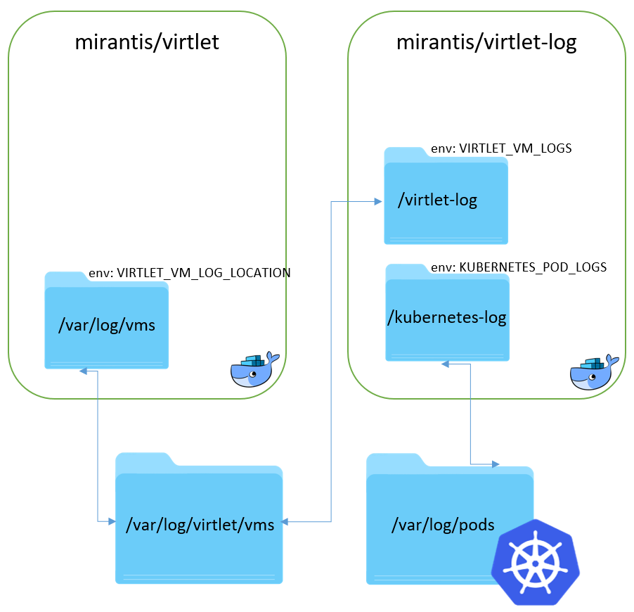
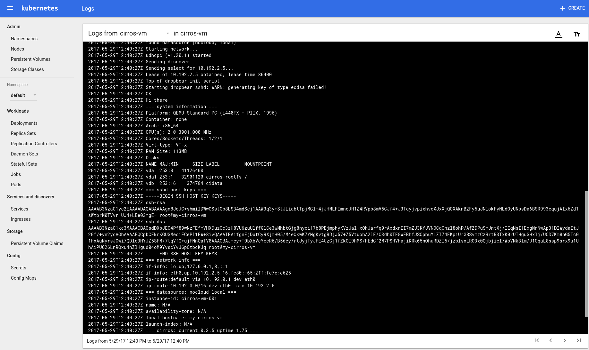

# VM Logging
Virtlet runs many VMs on Kubernetes and each of them writes something to `stdout` and `stderr`. User
is given two options:

1. redirect `stdout`/`stderr` into file (DEFAULT)
2. redirect `stdout`/`stderr` into pty console

## Redirecting stdout and stderr into file
By default VM logs are redirected into following file inside Virtlet container:
```
/var/log/vms/<sandboxId>/_<retry>.log
```
You can verify that this option is enabled by examining `deploy/virtlet-ds.yaml` blueprint. There is
an option that should specify location where `<sandboxId>` directories should appear:
```
- name: VIRTLET_VM_LOG_LOCATION
  value: "/var/log/vms"
```

### Architecture
Following image illustrates how logging is handled. There are two directories on host needed:

* **/var/log/virtlet/vms** (customizable) is where `mirantis/virtlet` container redirects VM stdout
  into.
* **/var/log/pods** (predefined by Kubernetes) is where Kubernetes expects JSON formatted logs to appear.



NOTE: It is important to configure volume mounts for `mirantis/virtlet` and `mirantis/virtlet-log`
containers according to the scheme above.

### Deploying virtlet-log DaemonSet
Kubernetes is not able to find and understand raw log files that contain direct dumps from VM. Therefore
we provide an auxilary container `mirantis/virtlet-log` that must be run as a DaemonSet on each node
where Virtlet DaemonSet is running. The purpose of this container, whose blueprint is provided in
`deploy/virtlet-log-ds.yaml`, is reformatting VM logs into a special JSON format that is understood
by Kubernetes.

Provided that:

* redirecting `stdout` and `stderr` into file is turned on
* `deploy/virtlet-log-ds.yaml` DaemonSet is deployed and running

user should be able to see logs on Kubernetes Dashboard:



Obtaining logs from CLI should also work:

```bash
$ kubectl logs cirros-vm
...
=== datasource: nocloud local ===
instance-id: cirros-vm-001
name: N/A
availability-zone: N/A
local-hostname: my-cirros-vm
launch-index: N/A
=== cirros: current=0.3.5 uptime=1.75 ===
  ____               ____  ____
 / __/ __ ____ ____ / __ / __/
   http://cirros-cloud.net


login as 'cirros' user. default password: 'cubswin:)'. use 'sudo' for root.
```

### Limitations
There are some limitations when redirecting logs into files is enabled:

- Command `virsh console <vm>` no longer works since libvirt serial port type is 'file' and not 'pty'.
- Logs can appear with up to 10 second delay for **new** VMs since virtlet-log container checks for
  new raw logs every 10 seconds. When new raw log is detected a new dedicated worker is spawned for
  it watching the raw log continously (similar like `tail -F`) and providing formatted log in real-time.

NOTE: The delay can be customized by setting `SLEEP_SECONDS` environment variable inside
`deploy/virtlet-log-ds.yaml`:
```
env:
- name: SLEEP_SECONDS
  value: 10
```


## Redirecting stdout and stderr into pty
In some cases it may be desired to enable `virsh console <VM>` command that is disabled in case when
redirecting everything into files is enabled (see **Limitations** above). Just use the following setting
in `deploy/virtlet-ds.yaml` blueprint:

```
- name: VIRTLET_VM_LOG_LOCATION
  value: "pty"
```
or comment out the whole section. It's safe to undeploy `depoly/virtlet-log-ds.yaml` at will since
it won't have any raw logs available to parse, but nothing will crash if you let it run.

### Limitations
There are some limitations when redirecting logs into files is disabled:

- command `kubectl logs <MY-POD>` will not work
- Kubernetes Dashboard will not display any logs for Virtlet pods

